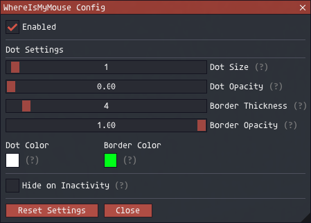

# whereismymouse v1.0.1

Shows a dot on your screen that follows your mouse cursor, so you stop losing track of it.

## Install

Drop the folder into `Game/addons/` and type `/addon load whereismymouse`.

## Commands

`/whereismymouse` opens the config.

## Settings

A size, an opacity and a color for the dot, and the same three for the border around it. Set the
dot's opacity to 0 for a hollow ring, with the dot size deciding how big the ring is.

Auto-hide fades it out after a set period without mouse movement, and it comes straight back when
you move.

## Notes

Settings are saved per character. It hides itself when you hide the game interface, during loading
screens and during cutscenes.

## Credits

Based on the Crosshair addon by atom0s.
